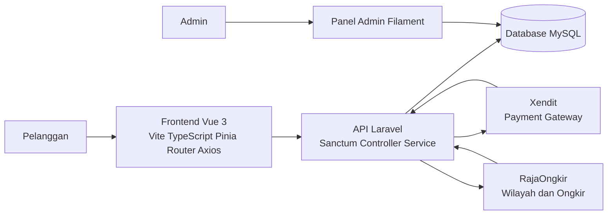
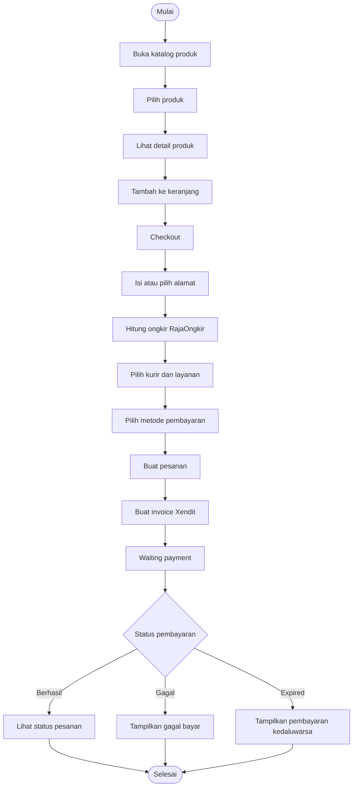
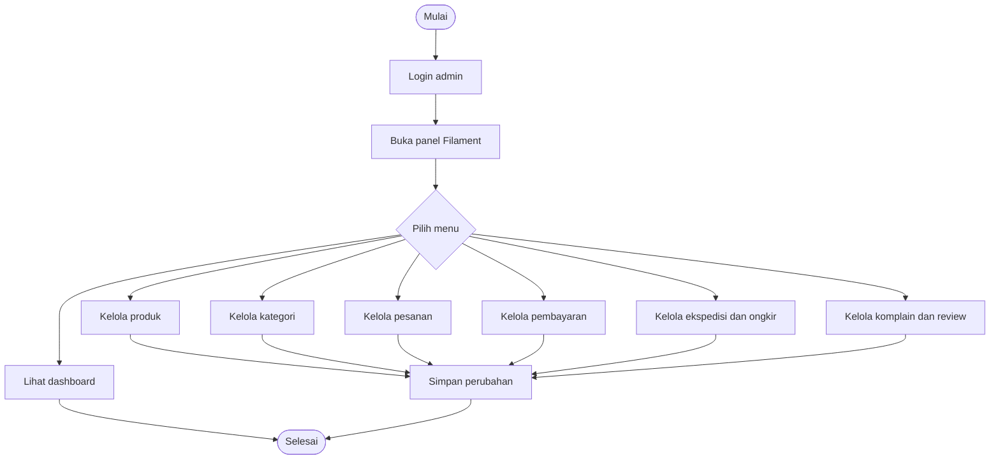
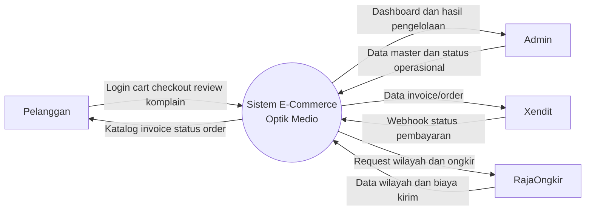
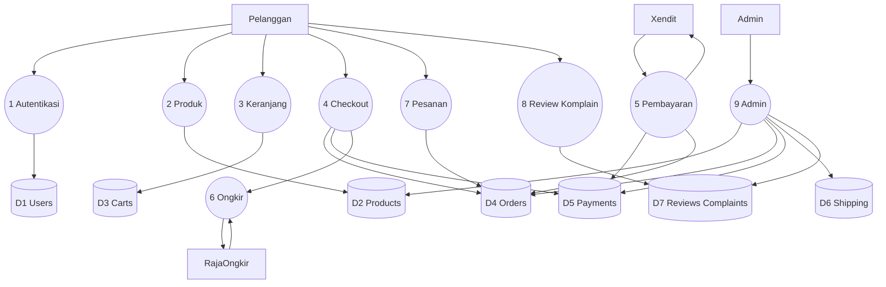
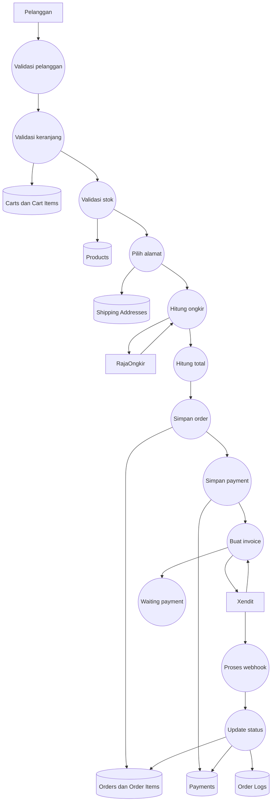
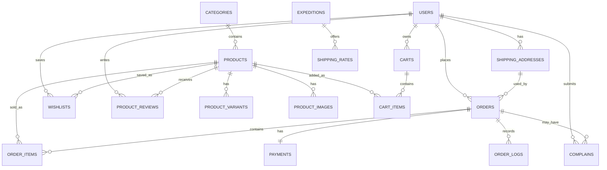
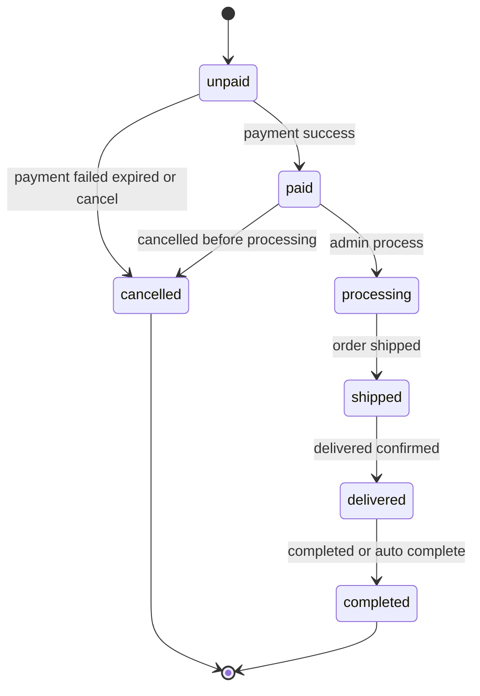
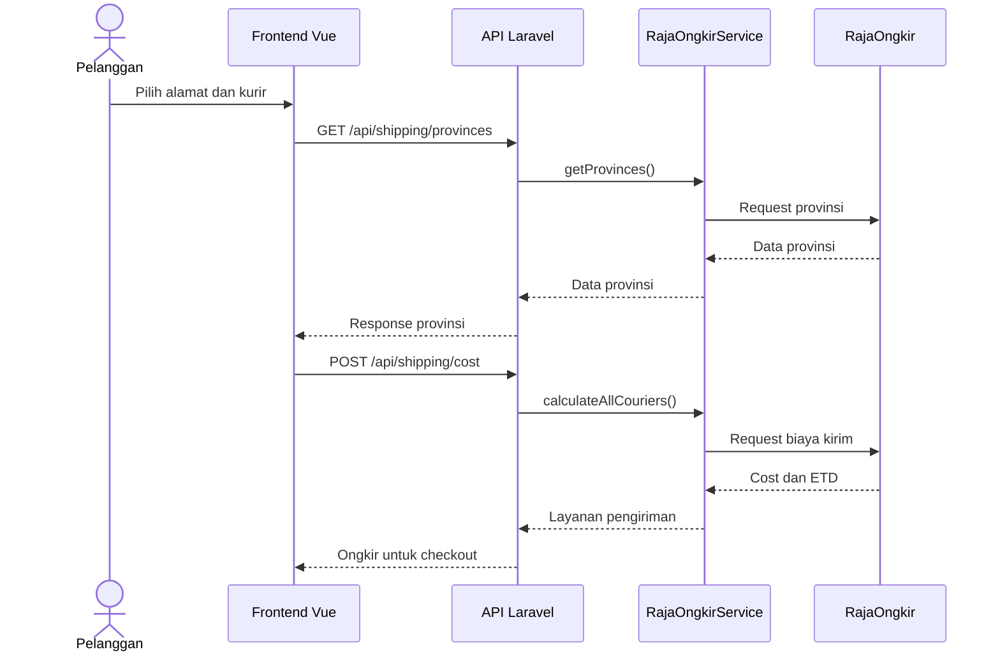
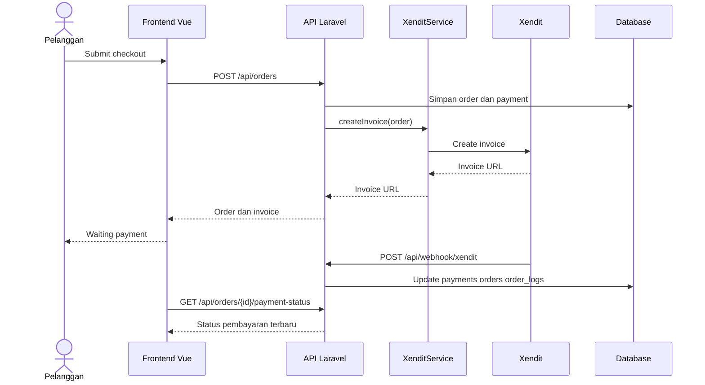

# Audit Lanjutan BAB III Repository Optik Medio

Dokumen ini merupakan audit lanjutan untuk memperkuat BAB III Hasil dan Pembahasan laporan magang berjudul **Implementasi Sistem E-Commerce Optik Medio Berbasis Web sebagai Studi Kasus Magang di PT Panemu Solusi Industri**. Audit dilakukan secara read-only terhadap repository `optik-medio-ecommerce`, terutama direktori `medio-fe` dan `medio-be`.

Catatan keamanan: credential, API key, token, webhook secret, endpoint production, data pelanggan asli, data transaksi asli, konfigurasi server internal, dan informasi rahasia perusahaan/klien tidak ditampilkan. Seluruh informasi sensitif harus ditulis sebagai `[DIREDAKSI]`.

## A. Ringkasan Final Fitur Aktual Repository

| No | Fitur | Status | File Frontend | File Backend | Database Terkait | Endpoint Terkait | Catatan untuk Laporan |
|---:|---|---|---|---|---|---|---|
| 1 | Katalog produk | Ada | `medio-fe/src/views/Product.vue`, `ProductRepository.ts` | `ProductController.php` | `products`, `categories` | `GET /api/products`, `GET /api/categories` | Masuk BAB III sebagai fitur inti pelanggan |
| 2 | Detail produk | Ada | `ProductDetail.vue` | `ProductController.php`, `Product.php` | `products`, `product_images`, `product_variants`, `product_reviews` | `GET /api/products/{slug}` | Jelaskan detail, gambar, varian, rekomendasi |
| 3 | Filter/search produk | Ada | `Product.vue`, `ProductRepository.ts` | `ProductController.php` | `products`, `categories` | `GET /api/products/filters`, `GET /api/products/search-suggestions`, `GET /api/products/brands` | Masuk BAB III dan screenshot katalog |
| 4 | Keranjang | Ada | `CartView.vue`, `cartStore.ts` | `CartController.php` | `carts`, `cart_items` | `GET /api/cart`, `POST /api/cart/items`, `PUT /api/cart/items/{itemId}` | Jelaskan keranjang lokal dan server |
| 5 | Sinkronisasi cart | Ada | `cartStore.ts` | `CartController.php` | `carts`, `cart_items` | `POST /api/cart/sync` | Masuk BAB III sebagai kontrol persistensi cart |
| 6 | Checkout | Ada | `views/checkout/CheckoutView.vue`, `OrderRepository.ts` | `OrderController.php` | `orders`, `order_items`, `payments` | `POST /api/orders/calculate`, `POST /api/orders` | Fitur utama untuk DFD Level 2 |
| 7 | Waiting payment | Ada | `views/checkout/WaitingPayment.vue`, `OrderRepository.ts` | `OrderController.php` | `orders`, `payments` | `GET /api/orders/{id}/payment-status`, `POST /api/orders/{id}/sync-payment` | Bahas polling dan sinkronisasi pembayaran |
| 8 | Login | Ada | `Login.vue`, `AuthRepository.ts`, `authStore.ts` | `AuthController.php` | `users`, `personal_access_tokens` | `POST /api/auth/login`, `GET /api/auth/me` | Masuk analisis aktor pelanggan |
| 9 | Register | Ada | `Register.vue`, `AuthRepository.ts` | `AuthController.php` | `users`, `otp_codes` | `POST /api/auth/register` | Jelaskan registrasi dan verifikasi |
| 10 | OTP/verifikasi akun | Ada | `AuthRepository.ts` | `AuthController.php`, `OtpCode.php` | `otp_codes` | `POST /api/auth/verify-otp`, `POST /api/auth/resend-otp` | Masuk BAB III atau lampiran autentikasi |
| 11 | Profil pelanggan | Ada | `Profile.vue`, `AuthRepository.ts` | `AuthController.php` | `users` | `PATCH /api/auth/profile` | Profil menjadi halaman gabungan beberapa menu |
| 12 | Alamat pelanggan | Ada | `Profile.vue`, `ShippingRepository.ts` | `ShippingController.php` | `shipping_addresses` | `GET/POST/PUT/DELETE /api/addresses` | Penting untuk checkout dan ongkir |
| 13 | Riwayat pesanan | Ada | `Profile.vue`, `OrderRepository.ts` | `OrderController.php` | `orders`, `order_items`, `payments` | `GET /api/orders`, `GET /api/orders/{id}` | Masuk screenshot pelanggan |
| 14 | Tracking pesanan | Ada | `Tracking.vue`, `OrderRepository.ts` | `OrderController.php`, `Order.php` | `orders`, `order_logs` | `GET /api/orders/{id}/tracking` | Tracking internal status/order log, bukan cek resi eksternal |
| 15 | Wishlist | Ada | `wishlistStore.ts`, `Profile.vue` | `WishlistController.php` | `wishlists` | `GET /api/wishlist`, `POST /api/wishlist/toggle` | Masuk BAB III atau lampiran fitur pelanggan |
| 16 | Share wishlist | Ada | `SharedWishlist.vue`, `ProductRepository.ts` | `WishlistController.php` | `wishlists` | `POST /api/wishlist/share`, `GET /api/wishlist/shared/{token}` | Masuk lampiran bila ruang BAB III terbatas |
| 17 | Komparasi produk | Ada | `ProductCompare.vue`, `compareStore.ts` | `ProductController.php` | `products` | `POST /api/products/compare` | Masuk BAB III sebagai fitur pendukung katalog |
| 18 | Ulasan produk | Ada | `ReviewRepository.ts` | `ReviewController.php`, `ProductReview.php` | `product_reviews` | `GET /api/products/{slug}/reviews`, `POST /api/reviews` | Ada test `ReviewWithPhotoTest.php` |
| 19 | Pengaduan/komplain | Ada | `Complaint.vue`, `ComplaintDetail.vue`, `ComplaintRepository.ts` | `ComplainController.php`, `Complain.php` | `complains` | `GET/POST /api/complaints`, `GET /api/complaints/{id}` | Masuk BAB III karena terkait layanan purna jual |
| 20 | Admin produk | Ada | Tidak melalui Vue, via Filament | `ProductResource.php` | `products`, `product_images`, `product_variants` | `/admin/products` | Screenshot Filament wajib |
| 21 | Admin kategori | Ada | Tidak melalui Vue, via Filament | `CategoryResource.php` | `categories` | `/admin/categories` | Masuk flowchart admin |
| 22 | Admin pesanan | Ada | Tidak melalui Vue, via Filament | `OrderResource.php` | `orders`, `order_items`, `order_logs` | `/admin/orders` | Jelaskan perubahan status dan log |
| 23 | Admin pembayaran | Ada | Tidak melalui Vue, via Filament | `PaymentResource.php`, `PaymentMethodResource.php`, `Banks/BankResource.php` | `payments`, `payment_methods`, `banks` | `/admin/payments`, `/admin/payment-methods`, `/admin/banks` | Pisahkan payment record dan master metode pembayaran |
| 24 | Admin ekspedisi/ongkir | Ada | Tidak melalui Vue, via Filament | `ExpeditionResource.php`, `ShippingRateResource.php` | `expeditions`, `shipping_rates` | `/admin/expeditions`, `/admin/shipping-rates` | Tidak ditemukan model `Shipment`; gunakan istilah ekspedisi/ongkir |
| 25 | Dashboard admin | Ada | Tidak melalui Vue, via Filament | `AdminActivityWidget.php`, `RecentOrdersWidget.php`, `LowStockWidget.php`, `TopProductsWidget.php` | orders, products, events | `/admin` | Masuk screenshot dashboard |
| 26 | Xendit invoice/payment | Ada | `WaitingPayment.vue`, `OrderRepository.ts` | `XenditService.php`, `OrderController.php` | `payments`, `orders` | `POST /api/orders`, `POST /api/orders/{id}/sync-payment` | Integrasi backend, bukan frontend langsung ke Xendit |
| 27 | Xendit webhook | Ada | Tidak langsung | `WebhookController.php`, `XenditWebhookTest.php` | `payments`, `orders`, `order_logs`, `webhook_event_logs` | `POST /api/webhook/xendit` | Endpoint lokal boleh ditulis, token tetap `[DIREDAKSI]` |
| 28 | RajaOngkir wilayah | Ada | `ShippingRepository.ts` | `RajaOngkirService.php`, `ShippingController.php` | `shipping_addresses`, `expeditions` | `GET /api/shipping/provinces`, `cities`, `districts` | Masuk integrasi pengiriman |
| 29 | RajaOngkir ongkos kirim | Ada | `ShippingRepository.ts`, `CheckoutView.vue` | `RajaOngkirService.php`, `ShippingController.php` | `shipping_rates`, `orders` | `POST /api/shipping/cost` | Masuk DFD checkout dan diagram sequence |
| 30 | Pengujian otomatis backend | Ada | Tidak relevan | `medio-be/tests/Feature/*` | database test | PHPUnit feature tests | Pisahkan dari pengujian black-box manual laporan |

Fitur yang tidak ditemukan atau perlu pembatasan narasi:

| Fitur/Klaim | Status | Catatan |
|---|---|---|
| Model `Shipment` terpisah | Tidak ditemukan di repository | Data pengiriman tersimpan pada `orders`, `expeditions`, dan `shipping_rates`; jangan menulis modul shipment terpisah |
| Frontend memanggil Xendit langsung | Tidak ditemukan di repository | Xendit diakses oleh backend melalui `XenditService.php`; frontend memantau status pembayaran melalui API order |
| Cek resi eksternal real-time | Perlu dikonfirmasi | Tracking yang ditemukan berbasis status order, tracking number, courier, dan order log |

## B. Naskah Akademik Ringkas untuk BAB III

### 1. Pengantar BAB III Hasil dan Pembahasan

Bab III membahas hasil analisis dan implementasi sistem e-commerce Optik Medio sebagai studi kasus pengembangan aplikasi web pada kegiatan magang. Pembahasan difokuskan pada struktur sistem, kebutuhan aktor, alur proses bisnis, rancangan data, endpoint API, implementasi frontend, implementasi backend, panel admin, integrasi layanan eksternal, serta pengujian. Seluruh pembahasan didasarkan pada artefak repository agar uraian teknis sesuai dengan sistem yang benar-benar tersedia. Bukti repository utama terdapat pada `medio-fe/src/router/index.ts`, `medio-fe/src/repositories`, `medio-be/routes/api.php`, `medio-be/app/Http/Controllers/API`, `medio-be/app/Models`, `medio-be/app/Services`, `medio-be/app/Filament/Resources`, dan `medio-be/database/migrations`.

### 2. Analisis Aktor dan Hak Akses

Sistem Optik Medio melibatkan dua aktor manusia dan dua sistem eksternal. Aktor manusia terdiri atas pelanggan dan admin. Pelanggan berinteraksi melalui antarmuka frontend Vue untuk melihat katalog, mengelola keranjang, melakukan checkout, memantau pembayaran, melihat riwayat pesanan, mengelola wishlist, memberikan ulasan, dan mengirim komplain. Admin berinteraksi melalui panel Filament untuk mengelola produk, kategori, pesanan, pembayaran, ekspedisi, ongkir, ulasan, komplain, dan dashboard operasional. Selain itu, Xendit dan RajaOngkir diposisikan sebagai aktor eksternal karena keduanya bertukar data langsung dengan sistem. Xendit memproses invoice dan mengirim webhook pembayaran, sedangkan RajaOngkir menyediakan data wilayah serta ongkos kirim.

### 3. Analisis Kebutuhan Sistem

Kebutuhan fungsional pelanggan mencakup autentikasi, katalog produk, detail produk, keranjang, checkout, pembayaran, riwayat pesanan, tracking, wishlist, komparasi produk, ulasan, dan komplain. Kebutuhan admin mencakup pengelolaan master data produk, kategori, payment method, ekspedisi, ongkir, pesanan, pembayaran, ulasan, dan komplain. Kebutuhan integrasi mencakup pembayaran Xendit dan perhitungan ongkos kirim RajaOngkir. Kebutuhan nonfungsional meliputi pemisahan konfigurasi sensitif, penggunaan token autentikasi Sanctum, validasi request, logging status pesanan, pengujian otomatis, serta pembatasan data rahasia dalam laporan.

### 4. Arsitektur Sistem

Arsitektur sistem menggunakan pola client-server. Frontend dibangun dengan Vue 3, Vite, TypeScript, Tailwind CSS, Pinia, Vue Router, dan Axios. Backend dibangun dengan Laravel, PHP 8.3, Sanctum, dan MySQL. Panel admin menggunakan Filament. Integrasi eksternal dilakukan melalui service backend, yaitu `XenditService.php` untuk pembayaran dan `RajaOngkirService.php` untuk wilayah serta ongkos kirim. Bukti teknologi terdapat pada `medio-fe/package.json`, `medio-be/composer.json`, `medio-be/routes/api.php`, dan `medio-be/config/services.php`.

### 5. Perancangan Alur Pelanggan

Alur pelanggan dimulai dari akses katalog produk, pemilihan produk, peninjauan detail, penambahan produk ke keranjang, checkout, pemilihan alamat dan kurir, pemilihan metode pembayaran, pembuatan order, pembuatan invoice pembayaran, waiting payment, hingga pemantauan status pesanan. Alur ini didukung oleh `ProductRepository.ts`, `cartStore.ts`, `OrderRepository.ts`, `ShippingRepository.ts`, `ProductController.php`, `CartController.php`, `OrderController.php`, `ShippingController.php`, dan `XenditService.php`.

### 6. Perancangan Alur Admin

Alur admin berjalan melalui panel Filament. Admin membuka dashboard, mengelola produk dan kategori, mengelola pesanan, memperbarui status pembayaran atau pesanan, mengelola ekspedisi dan ongkos kirim, serta memantau komplain dan ulasan. Implementasi alur admin didukung oleh `ProductResource.php`, `CategoryResource.php`, `OrderResource.php`, `PaymentResource.php`, `ExpeditionResource.php`, `ShippingRateResource.php`, `ComplainResource.php`, `ProductReviewResource.php`, dan widget dashboard di `medio-be/app/Filament/Widgets`.

### 7. Perancangan DFD

DFD sistem dirancang dengan empat entitas eksternal: pelanggan, admin, Xendit, dan RajaOngkir. Proses utama adalah Sistem E-Commerce Optik Medio. Pada Level 1, proses diuraikan menjadi autentikasi, pengelolaan produk, pengelolaan keranjang, checkout, pengelolaan pembayaran, pengelolaan ekspedisi/ongkir, pengelolaan pesanan, pengelolaan review/komplain, dan pengelolaan admin. DFD Level 2 difokuskan pada proses checkout karena proses ini menghubungkan cart, order, payment, RajaOngkir, Xendit, dan order log.

### 8. Perancangan ERD

ERD disusun berdasarkan migration dan model Laravel. Tabel inti meliputi `users`, `products`, `categories`, `carts`, `cart_items`, `orders`, `order_items`, `payments`, `shipping_addresses`, `expeditions`, `shipping_rates`, `product_reviews`, `wishlists`, `complains`, dan `order_logs`. Relasi utama meliputi user dengan order, produk dengan kategori, order dengan order item, order dengan payment, produk dengan review, serta order dengan log status. Bukti terdapat pada `medio-be/database/migrations` dan model di `medio-be/app/Models`.

### 9. Perancangan Endpoint API Umum

Endpoint API disusun dalam kelompok autentikasi, produk, cart, order, shipping, wishlist, review, complaint, dan webhook. Route utama dapat dilihat pada `medio-be/routes/api.php`. Frontend mengakses endpoint melalui repository seperti `AuthRepository.ts`, `ProductRepository.ts`, `OrderRepository.ts`, `ShippingRepository.ts`, `ReviewRepository.ts`, dan `ComplaintRepository.ts`.

### 10. Implementasi Frontend

Frontend mengatur navigasi melalui `medio-fe/src/router/index.ts`. Halaman utama yang ditemukan meliputi `Product.vue`, `ProductDetail.vue`, `CartView.vue`, `CheckoutView.vue`, `WaitingPayment.vue`, `Profile.vue`, `Tracking.vue`, `Complaint.vue`, `ComplaintDetail.vue`, `ProductCompare.vue`, `Login.vue`, `Register.vue`, dan `SharedWishlist.vue`. State aplikasi didukung oleh Pinia store seperti `authStore.ts`, `cartStore.ts`, `wishlistStore.ts`, dan `compareStore.ts`.

### 11. Implementasi Backend

Backend Laravel menyediakan API pada `routes/api.php` dan controller pada `app/Http/Controllers/API`. Model utama meliputi `User`, `Product`, `Cart`, `Order`, `Payment`, `Complain`, `ProductReview`, `Wishlist`, `Expedition`, dan `ShippingRate`. Service backend menangani integrasi Xendit dan RajaOngkir. Action order seperti `DecrementProductStockAction.php` dan `RestoreProductStockAction.php` mendukung kontrol stok pada proses transaksi.

### 12. Implementasi Panel Admin

Panel admin menggunakan Filament. Resource yang relevan dengan laporan meliputi `ProductResource.php`, `CategoryResource.php`, `OrderResource.php`, `PaymentResource.php`, `PaymentMethodResource.php`, `ExpeditionResource.php`, `ShippingRateResource.php`, `ProductReviewResource.php`, dan `ComplainResource.php`. Dashboard admin diperkuat oleh widget seperti `RecentOrdersWidget.php`, `LowStockWidget.php`, `TopProductsWidget.php`, dan `AdminActivityWidget.php`.

### 13. Integrasi RajaOngkir

Integrasi RajaOngkir digunakan untuk mengambil data provinsi, kota, distrik, dan menghitung ongkos kirim. Frontend memanggil endpoint shipping melalui `ShippingRepository.ts`. Backend menerima request melalui `ShippingController.php` dan meneruskannya ke `RajaOngkirService.php`. Konfigurasi API berada di `config/services.php` dan `.env.example`, tetapi nilai key tidak boleh ditampilkan dalam laporan.

### 14. Integrasi Xendit

Integrasi Xendit digunakan untuk membuat invoice pembayaran, sinkronisasi status pembayaran, dan menerima webhook. Backend membuat invoice melalui `XenditService.php`. Callback pembayaran diterima oleh `WebhookController.php` melalui `POST /api/webhook/xendit`. Status pembayaran kemudian memengaruhi data `payments`, `orders`, dan `order_logs`. Pengujian webhook didukung oleh `medio-be/tests/Feature/XenditWebhookTest.php`.

### 15. Pengujian Black-box

Pengujian black-box perlu disusun berdasarkan fungsi yang ditemukan pada repository. Repository telah memiliki pengujian otomatis backend seperti `AuthSessionTest.php`, `CartPersistenceTest.php`, `CheckoutControlTest.php`, `PaymentStatusTest.php`, `WishlistShareTest.php`, `ReviewWithPhotoTest.php`, `ShippingProtectionComplaintTest.php`, dan `XenditWebhookTest.php`. Untuk laporan, pengujian black-box manual tetap perlu dilengkapi dengan hasil aktual dan screenshot.

### 16. Kendala Teknis dan Solusi

Kendala teknis yang relevan meliputi validasi alamat, ketergantungan API RajaOngkir, sinkronisasi status pembayaran Xendit, keamanan webhook, validasi stok, sinkronisasi cart, tampilan checkout pada perangkat mobile, pemisahan environment development dan production, serta keamanan credential. Solusi yang ditemukan meliputi validasi request, service khusus integrasi, webhook token, polling/sync payment, action stok, dan file konfigurasi environment.

### 17. Evaluasi Hasil Magang

Studi kasus Optik Medio menunjukkan penerapan pengetahuan pengembangan web, basis data, integrasi API, pengujian, dan pemeliharaan sistem. Aktivitas magang yang berkaitan dengan issue, debugging, pengecekan server development, pengujian hasil perbaikan, dan pemahaman alur sebelum production dapat dijelaskan melalui proses analisis repository, validasi endpoint, pembacaan logika service, dan penyusunan pengujian. Pembahasan tetap dibatasi pada project studi kasus sehingga tidak membuka detail sistem internal perusahaan atau klien.

## C. Diagram Arsitektur Sistem

Arsitektur Optik Medio terdiri atas pelanggan yang mengakses frontend Vue, frontend yang berkomunikasi dengan API Laravel melalui Axios, API Laravel yang membaca dan menulis data ke MySQL, admin yang mengelola data melalui Filament, serta dua sistem eksternal yaitu Xendit dan RajaOngkir. Xendit berperan dalam pembayaran, sedangkan RajaOngkir berperan dalam data wilayah dan ongkos kirim.

Caption: **Gambar 3.x Arsitektur Sistem E-Commerce Optik Medio berbasis Vue, Laravel, MySQL, Filament, Xendit, dan RajaOngkir.**

## D. Flowchart Pelanggan

Alur pelanggan menggambarkan proses belanja mulai dari katalog hingga status pesanan. Simbol utama yang digunakan adalah terminator untuk awal/akhir, proses untuk aktivitas, decision untuk percabangan pembayaran, input/output untuk data alamat dan ongkir, serta database untuk penyimpanan order dan payment.

Caption: **Gambar 3.x Flowchart Pelanggan pada proses belanja dan pembayaran Optik Medio.**

## E. Flowchart Admin

Alur admin menggambarkan pengelolaan sistem melalui Filament. Admin melakukan login, membuka dashboard, memilih resource yang akan dikelola, menyimpan perubahan, dan memantau hasil melalui dashboard.

Caption: **Gambar 3.x Flowchart Admin pada panel Filament Optik Medio.**

## F. Tabel Simbol Flowchart dan DFD

### Tabel Simbol Flowchart

| No | Nama Simbol | Bentuk Simbol | Fungsi/Keterangan | Contoh Penggunaan pada Optik Medio |
|---:|---|---|---|---|
| 1 | Terminator | Oval | Menandai awal atau akhir proses | Mulai checkout, selesai pembayaran |
| 2 | Process | Persegi panjang | Menunjukkan aktivitas sistem | Hitung ongkir, buat order, buat invoice |
| 3 | Decision | Belah ketupat | Menunjukkan percabangan kondisi | Status pembayaran berhasil/gagal/expired |
| 4 | Input/Output | Jajar genjang | Menunjukkan data masuk atau keluar | Input alamat, output biaya ongkir |
| 5 | Flowline | Panah | Menunjukkan arah alur | Dari keranjang ke checkout |
| 6 | Database | Silinder | Menunjukkan penyimpanan data | Tabel `orders`, `payments`, `products` |
| 7 | Predefined Process | Persegi panjang dengan garis samping | Menunjukkan proses yang dipanggil dari modul lain | Memanggil service Xendit atau RajaOngkir |

### Tabel Simbol DFD

| No | Nama Simbol | Bentuk Simbol | Fungsi/Keterangan | Contoh Penggunaan pada Optik Medio |
|---:|---|---|---|---|
| 1 | External Entity | Persegi panjang | Entitas luar yang memberi atau menerima data | Pelanggan, Admin, Xendit, RajaOngkir |
| 2 | Process | Lingkaran atau persegi sudut tumpul | Proses pengolahan data | Proses checkout, proses pembayaran |
| 3 | Data Store | Dua garis sejajar atau silinder | Penyimpanan data | Data produk, data order, data payment |
| 4 | Data Flow | Panah | Aliran data antar komponen | Data ongkir, data invoice, data status order |

## G. DFD Level 0

Entitas eksternal pada DFD Level 0 adalah pelanggan, admin, Xendit, dan RajaOngkir. Proses utama adalah Sistem E-Commerce Optik Medio. Data store tidak wajib dimunculkan pada Level 0, tetapi dapat ditulis sebagai Database MySQL bila format kampus mengizinkan.

| Entitas | Arus Data Masuk ke Sistem | Arus Data Keluar dari Sistem | Bukti Repository |
|---|---|---|---|
| Pelanggan | data login, cart, checkout, review, komplain | katalog, invoice URL, status order, riwayat pesanan | `router/index.ts`, `routes/api.php` |
| Admin | data produk, kategori, pesanan, pembayaran, ongkir | dashboard, status operasi, data master | `app/Filament/Resources` |
| Xendit | webhook status pembayaran | data invoice/order untuk pembayaran | `XenditService.php`, `WebhookController.php` |
| RajaOngkir | data wilayah dan ongkir | request provinsi, kota, distrik, ongkir | `RajaOngkirService.php`, `ShippingController.php` |

Caption: **Gambar 3.x DFD Level 0 Sistem E-Commerce Optik Medio.**

## H. DFD Level 1

| Proses | Input | Output | Data Store | Entitas Terkait | File Repository Terkait | Narasi Laporan |
|---|---|---|---|---|---|---|
| 1. Autentikasi | email, password, OTP | token/session, profil | `users`, `otp_codes`, `personal_access_tokens` | Pelanggan | `AuthController.php`, `AuthRepository.ts` | Proses autentikasi digunakan untuk login, register, verifikasi OTP, dan profil pelanggan |
| 2. Pengelolaan produk | filter, slug, id produk | katalog, detail, compare | `products`, `categories`, `product_images`, `product_variants` | Pelanggan, Admin | `ProductController.php`, `ProductResource.php` | Produk dapat dilihat pelanggan dan dikelola admin |
| 3. Pengelolaan keranjang | product id, qty | cart item | `carts`, `cart_items` | Pelanggan | `CartController.php`, `cartStore.ts` | Keranjang menyimpan produk sebelum checkout |
| 4. Checkout | cart, alamat, kurir, payment method | order, order item, payment | `orders`, `order_items`, `payments` | Pelanggan | `OrderController.php`, `CheckoutView.vue` | Checkout menjadi proses inti transaksi |
| 5. Pengelolaan pembayaran | invoice, webhook, sync request | status payment/order | `payments`, `orders`, `order_logs` | Pelanggan, Xendit | `XenditService.php`, `WebhookController.php` | Xendit memengaruhi status pembayaran dan pesanan |
| 6. Pengelolaan ekspedisi/ongkir | lokasi, courier, berat | ongkir dan ETD | `shipping_addresses`, `expeditions`, `shipping_rates` | Pelanggan, RajaOngkir, Admin | `ShippingController.php`, `RajaOngkirService.php`, `ShippingRateResource.php` | Ongkir dipakai dalam total checkout |
| 7. Pengelolaan pesanan | order id, status | detail, tracking, riwayat | `orders`, `order_items`, `order_logs` | Pelanggan, Admin | `OrderController.php`, `OrderResource.php` | Pesanan dipantau pelanggan dan dikelola admin |
| 8. Pengelolaan review/komplain | rating, komentar, complaint | review/complaint record | `product_reviews`, `complains` | Pelanggan, Admin | `ReviewController.php`, `ComplainController.php` | Fitur layanan purna jual dan evaluasi produk |
| 9. Pengelolaan admin | data master dan operasional | data tersimpan, dashboard | berbagai tabel | Admin | `app/Filament/Resources`, `app/Filament/Widgets` | Admin mengelola operasional sistem melalui Filament |

Caption: **Gambar 3.x DFD Level 1 Sistem E-Commerce Optik Medio.**

## I. DFD Level 2 Proses Checkout

| No | Subproses | Input | Output | Data Store/Service | Bukti Repository |
|---:|---|---|---|---|---|
| 1 | Validasi pelanggan | token/session | user valid | `users` | `routes/api.php`, `AuthController.php` |
| 2 | Validasi keranjang | cart item | cart valid | `carts`, `cart_items` | `CartController.php`, `OrderController.php` |
| 3 | Validasi stok produk | product id, qty | stok cukup/ditolak | `products`, action stok | `DecrementProductStockAction.php`, `RestoreProductStockAction.php` |
| 4 | Pilih alamat pengiriman | address id | alamat valid | `shipping_addresses` | `ShippingController.php` |
| 5 | Ambil wilayah RajaOngkir | province/city id | data wilayah | RajaOngkir | `RajaOngkirService.php` |
| 6 | Hitung ongkos kirim | destination, weight, courier | cost dan ETD | RajaOngkir, `shipping_rates` | `POST /api/shipping/cost` |
| 7 | Pilih kurir | courier, service | shipping selection | `orders` | `OrderController.php` |
| 8 | Hitung total pembayaran | subtotal, diskon, ongkir | total order | `orders` | `OrderController.php` |
| 9 | Simpan order | order data | order record | `orders` | `OrderController.php`, `Order.php` |
| 10 | Simpan order items | item produk | item order | `order_items` | `OrderItem.php` |
| 11 | Simpan payment | payment method, amount | payment record | `payments` | `Payment.php` |
| 12 | Buat invoice Xendit | order_number, total_price, email | invoice URL | Xendit | `XenditService.php` |
| 13 | Tampilkan waiting payment | order id | status payment | frontend | `WaitingPayment.vue` |
| 14 | Terima webhook pembayaran | external_id, status | payload webhook | Xendit | `WebhookController.php` |
| 15 | Perbarui status pembayaran | payment status | payment updated | `payments` | `Payment.php` |
| 16 | Perbarui status pesanan | order status | order updated | `orders` | `Order.php` |
| 17 | Catat order log | event status | log status | `order_logs` | `Order.php`, `WebhookController.php` |

Caption: **Gambar 3.x DFD Level 2 Proses Checkout Optik Medio.**

## J. ERD Detail

Tabel utama yang disarankan masuk BAB III:

| Tabel | Fungsi | Kolom Kunci | Relasi Utama | Bukti |
|---|---|---|---|---|
| `users` | data pelanggan/admin | `id`, `name`, `email` | satu user memiliki banyak order, address, wishlist, review | `create_users_table.php`, `User.php` |
| `categories` | kategori produk | `id`, `name`, `slug` | satu kategori memiliki banyak produk | `create_categories_table.php`, `Category.php` |
| `products` | data produk optik | `id`, `category_id`, `name`, `slug`, `price`, `stock`, `weight` | milik kategori, memiliki variants/images/reviews/order_items | `create_products_table.php`, `Product.php` |
| `product_variants` | varian produk | `id`, `product_id` | milik produk | `create_product_variants_table.php` |
| `product_images` | gambar produk | `id`, `product_id` | milik produk | `create_product_images_table.php` |
| `carts` | keranjang user | `id`, `user_id` | memiliki cart_items | `create_carts_table.php`, `Cart.php` |
| `cart_items` | item keranjang | `id`, `cart_id`, `product_id`, `quantity` | milik cart dan produk | `create_carts_table.php`, `CartItem.php` |
| `shipping_addresses` | alamat pengiriman | `id`, `user_id`, `district_id` | milik user, digunakan order | `create_shipping_addresses_table.php` |
| `orders` | transaksi pesanan | `id`, `order_number`, `user_id`, `status`, `total_price` | milik user, memiliki order_items, payment, logs | `create_orders_table.php`, `Order.php` |
| `order_items` | rincian produk dalam order | `id`, `order_id`, `product_id`, `quantity`, `subtotal` | milik order dan produk | `create_order_items_table.php` |
| `payments` | data pembayaran | `id`, `order_id`, `transaction_id`, `provider`, `status` | milik order | `create_payments_table.php`, `Payment.php` |
| `order_logs` | riwayat status order | `id`, `order_id`, `previous_status`, `current_status` | milik order | `create_order_logs_table.php` |
| `expeditions` | master ekspedisi | `id`, `code`, `name` | terkait shipping rate/order | `create_expeditions_table.php` |
| `shipping_rates` | master tarif/layanan pengiriman | `id`, `expedition_id`, `service_name` | milik ekspedisi | `create_shipping_rates_table.php` |
| `wishlists` | produk favorit user | `id`, `user_id`, `product_id` | relasi user dan produk | `create_wishlists_and_loyalty_tables.php` |
| `product_reviews` | ulasan produk | `id`, `user_id`, `product_id`, `rating` | milik user dan produk | `create_product_reviews_table.php` |
| `complains` | pengaduan pelanggan | `id`, `user_id`, `order_id`, `status` | milik user dan order | `create_complains_table.php`, `Complain.php` |

Tabel pendukung yang cukup dimasukkan ke lampiran: `discounts`, `promos`, `loyalty_point_logs`, `app_settings`, `banners`, `articles`, `faqs`, `appointments`, `warranties`, `service_claims`, `commissions`, `commission_details`, `user_affiliators`, `referral_codes`, dan `referral_uses`.

Caption: **Gambar 3.x ERD inti Sistem E-Commerce Optik Medio.**

## K. Status Pesanan, Pembayaran, dan Pengiriman

### Tabel Status

| Jenis | Status | Makna | Pemicu | Bukti Repository |
|---|---|---|---|---|
| Pesanan | `unpaid` | pesanan dibuat tetapi pembayaran belum berhasil | checkout awal | `OrderController.php`, `Order.php` |
| Pesanan | `paid` | pembayaran berhasil diverifikasi | payment success/Xendit webhook | `Payment.php`, `WebhookController.php` |
| Pesanan | `processing` | pesanan sedang diproses admin | perubahan status admin | `OrderResource.php`, `Order.php` |
| Pesanan | `shipped` | pesanan dikirim | update admin/tracking number | `Order.php`, `OrderResource.php` |
| Pesanan | `delivered` | pesanan diterima pelanggan | confirm delivery/admin | `OrderController.php`, `Order.php` |
| Pesanan | `completed` | pesanan selesai | auto-complete atau admin | `AutoCompleteDeliveredOrders.php`, `Order.php` |
| Pesanan | `cancelled` | pesanan dibatalkan | cancel order/payment failed/expired | `Payment.php`, `OrderController.php` |
| Pembayaran | `pending` | pembayaran menunggu | invoice dibuat | `Payment.php`, `XenditService.php` |
| Pembayaran | `success` | pembayaran sukses | Xendit `PAID`/`SETTLED` | `XenditService.php`, `WebhookController.php` |
| Pembayaran | `failed` | pembayaran gagal | Xendit `FAILED` | `XenditService.php` |
| Pembayaran | `expired` | invoice kedaluwarsa | Xendit `EXPIRED` | `XenditService.php` |
| Pembayaran | `cancelled` | pembayaran dibatalkan | order cancelled/payment cancelled | `Payment.php` |
| Pengiriman | courier/service/tracking number | data pengiriman disimpan pada order | admin atau proses checkout | `Order.php`, `OrderController.php`, `Tracking.vue` |

### Diagram State Transition

Caption: **Gambar 3.x Transisi Status Pesanan dan Pembayaran Optik Medio.**

## L. Endpoint API Detail

| No | Modul | Method | Endpoint | Controller | Frontend Pemanggil | Tujuan | Database Terdampak |
|---:|---|---|---|---|---|---|---|
| 1 | Auth | POST | `/api/auth/register` | `AuthController@register` | `AuthRepository.ts` | Registrasi pelanggan | `users`, `otp_codes` |
| 2 | Auth | POST | `/api/auth/login` | `AuthController@login` | `AuthRepository.ts` | Login pelanggan | `users`, tokens |
| 3 | Auth | POST | `/api/auth/verify-otp` | `AuthController@verifyOtp` | `AuthRepository.ts` | Verifikasi OTP | `otp_codes`, `users` |
| 4 | Auth | POST | `/api/auth/resend-otp` | `AuthController@resendOtp` | `AuthRepository.ts` | Kirim ulang OTP | `otp_codes` |
| 5 | Produk | GET | `/api/products` | `ProductController@index` | `ProductRepository.ts` | Katalog produk | `products` |
| 6 | Produk | GET | `/api/products/{slug}` | `ProductController@show` | `ProductRepository.ts` | Detail produk | `products`, relasi produk |
| 7 | Produk | GET | `/api/products/filters` | `ProductController@filters` | `ProductRepository.ts` | Metadata filter | `products`, `categories` |
| 8 | Produk | GET | `/api/products/search-suggestions` | `ProductController@searchSuggestions` | `ProductRepository.ts` | Saran pencarian | `products` |
| 9 | Produk | POST | `/api/products/compare` | `ProductController@compare` | `ProductRepository.ts` | Komparasi produk | `products` |
| 10 | Cart | GET | `/api/cart` | `CartController@index` | `cartStore.ts` | Ambil cart | `carts`, `cart_items` |
| 11 | Cart | POST | `/api/cart/items` | `CartController@addItem` | `cartStore.ts` | Tambah item | `carts`, `cart_items` |
| 12 | Cart | PUT | `/api/cart/items/{itemId}` | `CartController@updateItem` | `cartStore.ts` | Ubah quantity | `cart_items` |
| 13 | Cart | POST | `/api/cart/sync` | `CartController@sync` | `cartStore.ts` | Sinkronisasi cart | `carts`, `cart_items` |
| 14 | Shipping | GET | `/api/shipping/provinces` | `ShippingController@provinces` | `ShippingRepository.ts` | Ambil provinsi | eksternal RajaOngkir |
| 15 | Shipping | GET | `/api/shipping/cities` | `ShippingController@cities` | `ShippingRepository.ts` | Ambil kota | eksternal RajaOngkir |
| 16 | Shipping | GET | `/api/shipping/districts` | `ShippingController@districts` | `ShippingRepository.ts` | Ambil distrik | eksternal RajaOngkir |
| 17 | Shipping | POST | `/api/shipping/cost` | `ShippingController@cost` | `ShippingRepository.ts` | Hitung ongkir | `shipping_rates`, eksternal RajaOngkir |
| 18 | Address | GET/POST | `/api/addresses` | `ShippingController` | `Profile.vue`, `ShippingRepository.ts` | Kelola alamat | `shipping_addresses` |
| 19 | Order | POST | `/api/orders/calculate` | `OrderController@calculate` | `CheckoutView.vue` | Simulasi total order | `products`, shipping |
| 20 | Order | POST | `/api/orders` | `OrderController@store` | `OrderRepository.ts` | Buat order | `orders`, `order_items`, `payments` |
| 21 | Order | GET | `/api/orders` | `OrderController@index` | `OrderRepository.ts` | Riwayat order | `orders` |
| 22 | Order | GET | `/api/orders/{id}` | `OrderController@show` | `OrderRepository.ts` | Detail order | `orders`, relasi |
| 23 | Order | GET | `/api/orders/{id}/tracking` | `OrderController@tracking` | `OrderRepository.ts` | Tracking order | `orders`, `order_logs` |
| 24 | Payment | GET | `/api/orders/{id}/payment-status` | `OrderController@paymentStatus` | `WaitingPayment.vue` | Polling payment | `payments`, `orders` |
| 25 | Payment | POST | `/api/orders/{id}/sync-payment` | `OrderController@syncPayment` | `WaitingPayment.vue` | Sinkron Xendit | `payments`, `orders` |
| 26 | Wishlist | POST | `/api/wishlist/toggle` | `WishlistController@toggle` | `wishlistStore.ts` | Toggle wishlist | `wishlists` |
| 27 | Wishlist | POST | `/api/wishlist/share` | `WishlistController@createShareLink` | `wishlistStore.ts` | Share wishlist | `wishlists` |
| 28 | Review | POST | `/api/reviews` | `ReviewController@store` | `ReviewRepository.ts` | Tambah ulasan | `product_reviews` |
| 29 | Complaint | POST | `/api/complaints` | `ComplainController@store` | `ComplaintRepository.ts` | Buat komplain | `complains` |
| 30 | Webhook | POST | `/api/webhook/xendit` | `WebhookController@xendit` | Xendit eksternal | Callback pembayaran | `payments`, `orders`, `order_logs` |

## M. Integrasi RajaOngkir Detail

Tujuan integrasi RajaOngkir adalah menyediakan data wilayah dan menghitung ongkos kirim pada proses checkout. Frontend terkait adalah `ShippingRepository.ts` dan `CheckoutView.vue`. Backend terkait adalah `ShippingController.php` dan `RajaOngkirService.php`. Endpoint lokal yang digunakan adalah `/api/shipping/provinces`, `/api/shipping/cities`, `/api/shipping/districts`, dan `/api/shipping/cost`.

Input request utama meliputi `province_id`, `city_id`, `destination`, `weight`, dan `courier`. Output response berupa daftar wilayah, nama layanan, biaya (`cost`), dan estimasi (`etd`). Alur provinsi-kota-distrik digunakan untuk menyusun alamat pengiriman, sedangkan alur hitung ongkir digunakan saat checkout untuk menentukan biaya pengiriman dan total pembayaran. Error handling perlu dijelaskan sebagai proses penanganan kegagalan API eksternal, validasi input, dan pencegahan credential masuk laporan. Data yang tidak boleh ditampilkan meliputi API key, base URL production internal, response mentah berisi data sensitif, dan konfigurasi server.

| Input | Endpoint Lokal | Method Service | Output | Hubungan Checkout |
|---|---|---|---|---|
| kosong | `GET /api/shipping/provinces` | `getProvinces()` | daftar provinsi | pilihan alamat |
| `province_id` | `GET /api/shipping/cities` | `getCities()` | daftar kota | pilihan alamat |
| `city_id` | `GET /api/shipping/districts` | `getDistricts()` | daftar distrik | tujuan pengiriman |
| `destination`, `weight`, `courier` | `POST /api/shipping/cost` | `calculateAllCouriers()` | layanan, biaya, ETD | total checkout |

Narasi siap-tempel: Integrasi RajaOngkir pada Optik Medio digunakan untuk mendukung proses pengiriman. Sistem mengambil data wilayah secara bertahap mulai dari provinsi, kota, hingga distrik. Setelah alamat tujuan dan berat pesanan diketahui, sistem menghitung ongkos kirim melalui service backend. Pendekatan ini membuat frontend tidak menyimpan API key RajaOngkir dan menjaga agar komunikasi dengan layanan eksternal dilakukan melalui backend.

Caption: **Gambar 3.x Sequence Diagram Integrasi RajaOngkir pada proses checkout.**

## N. Integrasi Xendit Detail

Tujuan integrasi Xendit adalah menangani pembayaran melalui invoice, webhook, dan sinkronisasi status. Frontend terkait adalah `WaitingPayment.vue` dan `OrderRepository.ts`. Backend terkait adalah `XenditService.php`, `OrderController.php`, `WebhookController.php`, `Payment.php`, dan `Order.php`. Endpoint lokal yang digunakan adalah `POST /api/orders`, `GET /api/orders/{id}/payment-status`, `POST /api/orders/{id}/sync-payment`, dan `POST /api/webhook/xendit`.

Input pembuatan invoice meliputi `order_number` sebagai `external_id`, `total_price` sebagai amount, email pembayar, deskripsi, durasi invoice, dan redirect URL. Output invoice berupa URL pembayaran yang disimpan pada payment/order response. Waiting payment memantau status pembayaran melalui endpoint order. Webhook Xendit memvalidasi token `[DIREDAKSI]`, mencari payment berdasarkan `transaction_id` atau `external_id`, memperbarui status payment, memperbarui status order, dan mencatat order log.

Mapping status yang ditemukan:

| Status Xendit | Status Payment Lokal | Status Order Lokal | Bukti |
|---|---|---|---|
| `PAID` | `success` | `paid` | `XenditService.php`, `WebhookController.php` |
| `SETTLED` | `success` | `paid` | `XenditService.php` |
| `EXPIRED` | `expired` | `cancelled` bila masih unpaid/paid sesuai logika payment | `XenditService.php`, `Payment.php` |
| `FAILED` | `failed` | `cancelled` bila masih unpaid/paid sesuai logika payment | `XenditService.php`, `Payment.php` |
| status lain | `pending` | status order berjalan | `XenditService.php` |

| Input | Endpoint/Method | Output | Database Terdampak |
|---|---|---|---|
| order checkout | `OrderController@store`, `createInvoice()` | order, payment, invoice URL | `orders`, `order_items`, `payments` |
| order id | `paymentStatus()` | status payment/order | `orders`, `payments` |
| order id | `syncPayment()` | status hasil sinkronisasi | `orders`, `payments` |
| webhook payload | `WebhookController@xendit` | update payment/order/log | `payments`, `orders`, `order_logs`, `webhook_event_logs` |

Narasi siap-tempel: Integrasi Xendit pada Optik Medio dirancang agar seluruh komunikasi pembayaran dilakukan melalui backend. Setelah order dibuat, backend membuat invoice Xendit menggunakan nomor order sebagai identitas eksternal. Pelanggan diarahkan ke proses pembayaran dan halaman waiting payment digunakan untuk memantau status. Ketika pembayaran berhasil, gagal, atau kedaluwarsa, Xendit mengirim webhook ke backend. Webhook tersebut memicu pembaruan status pembayaran dan pesanan sehingga data pada sistem tetap sinkron.

Caption: **Gambar 3.x Sequence Diagram Integrasi Xendit pada proses pembayaran Optik Medio.**

## O. Screenshot dan Lampiran

| No | Nama Screenshot | Lokasi Halaman/Menu | Aktor | Data Kondisi yang Harus Disiapkan | Tujuan Screenshot | Caption yang Disarankan | Masuk | Prioritas |
|---:|---|---|---|---|---|---|---|---|
| 1 | Katalog produk | `/products` | Pelanggan | Produk aktif tersedia | Menunjukkan katalog | Tampilan katalog produk Optik Medio | BAB III | Wajib |
| 2 | Detail produk | `/products/{slug}` | Pelanggan | Produk punya gambar/varian | Menunjukkan detail produk | Tampilan detail produk | BAB III | Wajib |
| 3 | Keranjang | `/cart` | Pelanggan | Minimal satu item cart | Menunjukkan cart | Tampilan keranjang belanja | BAB III | Wajib |
| 4 | Checkout alamat | `/checkout` | Pelanggan | User login dan alamat tersedia | Menunjukkan input alamat | Tampilan pemilihan alamat checkout | BAB III | Wajib |
| 5 | Pilihan ongkir RajaOngkir | `/checkout` | Pelanggan | Alamat dan berat produk valid | Menunjukkan ongkir | Tampilan pilihan layanan ongkir | BAB III | Wajib |
| 6 | Pilihan pembayaran | `/checkout` | Pelanggan | Payment method aktif | Menunjukkan payment method | Tampilan pemilihan metode pembayaran | BAB III | Wajib |
| 7 | Waiting payment Xendit | `/waiting-payment/{id}` | Pelanggan | Order Xendit dibuat | Menunjukkan payment monitoring | Tampilan menunggu pembayaran Xendit | BAB III | Wajib |
| 8 | Riwayat pesanan | `/orders` atau profil | Pelanggan | Minimal satu order | Menunjukkan history | Tampilan riwayat pesanan pelanggan | BAB III | Wajib |
| 9 | Tracking pesanan | `/tracking/{id}` | Pelanggan | Order dengan status/tracking | Menunjukkan pelacakan | Tampilan tracking pesanan | BAB III | Wajib |
| 10 | Profil pelanggan | `/profile` | Pelanggan | User login | Menunjukkan profil | Tampilan profil pelanggan | Lampiran | Disarankan |
| 11 | Wishlist | `/wishlist` atau profil | Pelanggan | Wishlist tidak kosong | Menunjukkan wishlist | Tampilan wishlist pelanggan | Lampiran | Disarankan |
| 12 | Share wishlist | `/wishlist/shared/{token}` | Pelanggan | Link share dibuat | Menunjukkan share wishlist | Tampilan wishlist yang dibagikan | Lampiran | Disarankan |
| 13 | Komparasi produk | `/compare` | Pelanggan | Minimal dua produk | Menunjukkan compare | Tampilan komparasi produk | Lampiran | Disarankan |
| 14 | Ulasan produk | Detail produk/order | Pelanggan | Produk/order valid | Menunjukkan review | Tampilan ulasan produk | Lampiran | Disarankan |
| 15 | Pengaduan | `/complaints/new` | Pelanggan | Order valid | Menunjukkan form komplain | Tampilan pengaduan pelanggan | BAB III | Wajib |
| 16 | Login/register/OTP | `/login`, `/register` | Pelanggan | Akun uji | Menunjukkan auth | Tampilan autentikasi pelanggan | Lampiran | Disarankan |
| 17 | Dashboard admin | `/admin` | Admin | Admin login | Menunjukkan dashboard | Dashboard admin Filament | BAB III | Wajib |
| 18 | Admin produk | `/admin/products` | Admin | Produk tersedia | Menunjukkan CRUD produk | Panel admin produk | BAB III | Wajib |
| 19 | Admin kategori | `/admin/categories` | Admin | Kategori tersedia | Menunjukkan CRUD kategori | Panel admin kategori | Lampiran | Disarankan |
| 20 | Admin pesanan | `/admin/orders` | Admin | Order tersedia | Menunjukkan manajemen order | Panel admin pesanan | BAB III | Wajib |
| 21 | Admin pembayaran | `/admin/payments` | Admin | Payment tersedia | Menunjukkan payment admin | Panel admin pembayaran | BAB III | Wajib |
| 22 | Admin ekspedisi/ongkir | `/admin/expeditions`, `/admin/shipping-rates` | Admin | Data ekspedisi | Menunjukkan shipping admin | Panel admin ekspedisi dan ongkir | BAB III | Wajib |
| 23 | Admin review/komplain | `/admin/product-reviews`, `/admin/complains` | Admin | Data review/komplain | Menunjukkan layanan purna jual | Panel admin review dan komplain | Lampiran | Disarankan |
| 24 | Bukti hasil pengujian | Browser atau terminal test | Penguji | Skenario uji | Bukti validasi | Dokumentasi hasil pengujian black-box | Lampiran | Wajib |

## P. Pengujian Black-box Final

| No | Fitur | Skenario | Langkah Pengujian | Data Uji | Hasil yang Diharapkan | Hasil Aktual | Status | Bukti Screenshot | Bukti Repository |
|---:|---|---|---|---|---|---|---|---|---|
| 1 | Register pelanggan | Pendaftaran akun baru | Buka register, isi data, submit | nama, email, password valid | Akun dibuat dan OTP dikirim/diminta | Perlu diuji manual | Perlu Diuji | Lampiran auth | `Register.vue`, `AuthController.php` |
| 2 | Login pelanggan | Login akun valid | Buka login, isi credential | email/password valid | User masuk dan diarahkan ke halaman tujuan | Perlu diuji manual | Perlu Diuji | Lampiran auth | `Login.vue`, `AuthSessionTest.php` |
| 3 | Verifikasi OTP | OTP valid | Masukkan OTP | kode valid | Akun terverifikasi | Perlu diuji manual | Perlu Diuji | Lampiran OTP | `AuthRepository.ts`, `OtpCode.php` |
| 4 | Katalog produk | Produk tampil | Buka `/products` | filter kosong | Daftar produk tampil | Didukung repository | Perlu Diuji | Screenshot katalog | `Product.vue`, `ProductDiscoveryTest.php` |
| 5 | Detail produk | Detail produk tampil | Klik produk | slug valid | Detail, gambar, harga tampil | Didukung repository | Perlu Diuji | Screenshot detail | `ProductDetail.vue`, `ProductController.php` |
| 6 | Filter/search produk | Filter berjalan | Pilih filter/search | keyword/brand/category | Produk terfilter | Didukung repository | Perlu Diuji | Screenshot filter | `ProductFilterMetadataTest.php` |
| 7 | Tambah keranjang | Item masuk cart | Klik tambah cart | product id, qty 1 | Cart bertambah | Didukung repository | Perlu Diuji | Screenshot cart | `CartController.php`, `cartStore.ts` |
| 8 | Update jumlah keranjang | Quantity berubah | Ubah qty item | qty valid | Subtotal berubah | Didukung repository | Perlu Diuji | Screenshot cart | `CartPersistenceTest.php` |
| 9 | Checkout | Order dibuat | Isi alamat, shipping, payment, submit | cart valid | Order dan payment dibuat | Didukung repository | Perlu Diuji | Screenshot checkout | `CheckoutControlTest.php` |
| 10 | Hitung ongkir RajaOngkir | Ongkir tampil | Pilih alamat dan kurir | district, weight | Cost dan ETD muncul | Didukung repository | Perlu Diuji | Screenshot ongkir | `ShippingController.php`, `RajaOngkirService.php` |
| 11 | Buat invoice Xendit | Invoice dibuat | Checkout dengan Xendit | order valid | Invoice URL tersedia | Didukung repository | Perlu Diuji | Screenshot waiting payment | `XenditService.php` |
| 12 | Waiting payment | Status dipantau | Buka waiting payment | order id | Status payment tampil | Didukung repository | Perlu Diuji | Screenshot waiting | `WaitingPayment.vue`, `PaymentStatusTest.php` |
| 13 | Sync status pembayaran | Status sinkron | Klik/trigger sync | order id Xendit | Status payment/order diperbarui | Didukung repository | Perlu Diuji | Screenshot status | `OrderRepository.ts`, `XenditService.php` |
| 14 | Riwayat pesanan | Daftar order tampil | Buka menu pesanan | user login | Riwayat tampil | Didukung repository | Perlu Diuji | Screenshot order | `OrderController@index` |
| 15 | Tracking pesanan | Tracking tampil | Buka `/tracking/{id}` | order id valid | Status, kurir, tracking number tampil | Didukung repository | Perlu Diuji | Screenshot tracking | `Tracking.vue`, `OrderController@tracking` |
| 16 | Wishlist | Toggle wishlist | Klik wishlist | product id | Produk masuk/keluar wishlist | Didukung repository | Perlu Diuji | Screenshot wishlist | `WishlistShareTest.php` |
| 17 | Share wishlist | Link share dibuat | Klik share wishlist | wishlist ada | Link/token share tersedia | Didukung repository | Perlu Diuji | Screenshot share | `WishlistController.php` |
| 18 | Komparasi | Bandingkan produk | Pilih dua produk | dua product id | Tabel compare tampil | Didukung repository | Perlu Diuji | Screenshot compare | `ProductCompare.vue` |
| 19 | Ulasan | Tambah review | Submit review | order/product valid | Review tersimpan | Didukung repository | Perlu Diuji | Screenshot review | `ReviewWithPhotoTest.php` |
| 20 | Pengaduan | Buat komplain | Submit form complaint | order id, deskripsi | Komplain tersimpan | Didukung repository | Perlu Diuji | Screenshot complaint | `ShippingProtectionComplaintTest.php` |
| 21 | Admin tambah produk | Produk tersimpan | Buka Filament product, create | data produk valid | Produk tampil di katalog | Perlu diuji manual | Perlu Diuji | Screenshot admin produk | `ProductResource.php` |
| 22 | Admin ubah status pesanan | Status berubah | Buka order resource, ubah status | order id/status | Order log tercatat | Perlu diuji manual | Perlu Diuji | Screenshot admin order | `OrderResource.php`, `Order.php` |
| 23 | Admin kelola pembayaran | Payment dikelola | Buka payment resource | payment record | Payment terlihat/terkelola | Perlu diuji manual | Perlu Diuji | Screenshot admin payment | `PaymentResource.php` |
| 24 | Admin kelola ekspedisi/ongkir | Data shipping dikelola | Buka expedition/shipping rate | data ekspedisi | Data tersimpan | Perlu diuji manual | Perlu Diuji | Screenshot shipping admin | `ExpeditionResource.php`, `ShippingRateResource.php` |
| 25 | Webhook Xendit | Callback sukses | Kirim webhook test valid | external_id, status PAID | Payment success dan order paid | Didukung test otomatis | Perlu Diuji manual/lampiran test | Screenshot/log test | `XenditWebhookTest.php`, `WebhookController.php` |

## Q. Kendala Teknis dan Solusi Final

| No | Kendala | Penyebab | Dampak | Solusi | Status | Bukti Repository | Narasi Singkat untuk Laporan |
|---:|---|---|---|---|---|---|---|
| 1 | Validasi alamat | Checkout memerlukan wilayah dan alamat lengkap | Ongkir/order gagal dihitung | Validasi request dan endpoint address | Ada | `ShippingController.php`, `shipping_addresses` | Validasi alamat diperlukan agar biaya pengiriman akurat |
| 2 | Ketergantungan RajaOngkir | API eksternal bisa lambat/gagal | Ongkir tidak tampil | Service khusus dan error handling | Ada/Rekomendasi uji | `RajaOngkirService.php` | Integrasi eksternal perlu ditangani dengan validasi dan fallback pesan error |
| 3 | Ketergantungan Xendit | Status pembayaran berasal dari gateway eksternal | Order bisa belum sinkron | Webhook, polling, dan sync payment | Ada | `XenditService.php`, `WebhookController.php` | Sinkronisasi pembayaran menjadi kendala utama integrasi payment |
| 4 | Keamanan webhook | Endpoint menerima callback luar | Risiko spoofing callback | Token webhook dan allowed IP | Ada | `config/services.php`, `WebhookController.php` | Webhook harus divalidasi dan secret tidak boleh ditampilkan |
| 5 | Validasi stok | Produk bisa dibeli melebihi stok | Overselling | Decrement/restore stock action | Ada | `DecrementProductStockAction.php`, `RestoreProductStockAction.php` | Kontrol stok penting dalam transaksi e-commerce |
| 6 | Sinkronisasi cart | Cart dapat berada di state frontend dan backend | Data cart tidak konsisten | Endpoint `POST /api/cart/sync` | Ada | `CartController.php`, `cartStore.ts` | Sinkronisasi cart menjaga konsistensi belanja |
| 7 | Responsif checkout | Checkout memuat alamat, ongkir, payment | Pengalaman mobile bisa padat | Uji responsive dan screenshot mobile | Perlu uji manual | `CheckoutView.vue` | Tampilan checkout perlu divalidasi pada perangkat mobile |
| 8 | Environment development/production | Konfigurasi integrasi berbeda | Risiko salah key/endpoint | `.env.example`, config services | Ada | `.env.example`, `config/services.php` | Pemisahan environment mencegah kebocoran konfigurasi |
| 9 | Keamanan credential | API key/token bersifat rahasia | Risiko kebocoran data | Redaksi `[DIREDAKSI]` | Wajib | `.env.example`, `config/services.php` | Laporan tidak boleh memuat credential |
| 10 | Pengujian fitur | Fitur banyak dan lintas modul | Validasi manual dapat terlewat | Tabel black-box dan feature tests | Ada/Perlu manual | `tests/Feature/*` | Pengujian perlu memadukan test otomatis dan dokumentasi manual |
| 11 | Status order/payment | Status berubah dari webhook/admin/user | Status bisa ambigu | State transition dan order log | Ada | `Order.php`, `Payment.php`, `order_logs` | Status perlu dijelaskan dalam tabel dan diagram |

## R. Revisi Laporan Berdasarkan Audit

| No | Lokasi Laporan | Kondisi Saat Ini | Masalah | Revisi Final | Data Repository yang Digunakan | Prioritas |
|---:|---|---|---|---|---|---|
| 1 | BAB I Latar Belakang | Umum tentang e-commerce | Belum menekankan studi kasus mandiri | Tambahkan konteks Optik Medio sebagai studi kasus e-commerce optik | struktur `medio-fe`, `medio-be` | Wajib |
| 2 | BAB I Tujuan Khusus | Belum teknis | Tujuan belum terukur | Tambahkan tujuan analisis frontend, backend, admin, integrasi, testing | route, controller, resource | Wajib |
| 3 | BAB I Manfaat | Umum | Belum mengaitkan magang dengan debugging/testing | Tambahkan manfaat pemahaman alur dev-test-production | `tests/Feature`, service | Disarankan |
| 4 | BAB II Teknologi | Perlu validasi stack | Risiko stack tidak sesuai repo | Sesuaikan dengan Vue 3, Vite, TS, Tailwind, Pinia, Router, Axios, Laravel, Sanctum, Filament, MySQL | `package.json`, `composer.json` | Wajib |
| 5 | BAB II Jadwal | Belum berbasis aktivitas | Perlu hubungan dengan kegiatan magang | Tambahkan fase analisis issue, debugging, testing, dokumentasi | repository dan narasi magang | Disarankan |
| 6 | BAB III Analisis Kebutuhan | Belum rinci | Aktor dan fitur belum lengkap | Tambahkan tabel aktor, kebutuhan fungsional, nonfungsional | `router/index.ts`, `routes/api.php` | Wajib |
| 7 | BAB III Perancangan Sistem | Belum cukup diagram | DFD/flowchart kurang | Tambahkan arsitektur, flowchart pelanggan/admin, DFD 0-2 | diagram bagian C-I | Wajib |
| 8 | BAB III Perancangan Antarmuka | Belum banyak bukti visual | Screenshot belum lengkap | Tambahkan daftar screenshot wajib | file views dan Filament | Wajib |
| 9 | BAB III Implementasi | Belum repo-backed | Klaim perlu bukti file | Tulis implementasi frontend/backend/admin dengan bukti file | controller, model, resource | Wajib |
| 10 | BAB III Integrasi | Perlu detail | Xendit/RajaOngkir harus jelas | Tambahkan sequence dan tabel input-output | `XenditService.php`, `RajaOngkirService.php` | Wajib |
| 11 | BAB III Pengujian | Belum siap | Hasil aktual belum diisi | Gunakan tabel black-box dan lampiran screenshot | `tests/Feature/*` | Wajib |
| 12 | BAB III Kendala | Belum spesifik | Kendala harus relevan repo | Tambahkan kendala validasi, webhook, stok, environment | bagian Q | Wajib |
| 13 | BAB III Evaluasi | Belum kuat | Harus mengaitkan magang dan studi kasus | Tambahkan evaluasi pembelajaran full-stack dan integrasi | seluruh audit | Wajib |
| 14 | BAB IV Kesimpulan | Masih umum | Belum menjawab hasil implementasi | Simpulkan sistem, fitur, integrasi, testing, batasan | ringkasan fitur | Wajib |
| 15 | BAB IV Saran | Belum teknis | Perlu rekomendasi lanjutan | Tambahkan saran monitoring, responsive test, hardening webhook | kendala teknis | Disarankan |
| 16 | Daftar Pustaka | Belum lengkap | Referensi resmi dibutuhkan | Tambahkan Laravel, Vue, Filament, Xendit, RajaOngkir/Komerce | docs resmi | Wajib |
| 17 | Lampiran | Belum lengkap | Bukti visual dan uji kurang | Tambahkan screenshot, hasil uji, diagram, endpoint | bagian O dan P | Wajib |

## S. Paket Final untuk Penyusunan Laporan

### 1. Ringkasan Project

Optik Medio adalah sistem e-commerce optik berbasis web yang dibangun menggunakan frontend Vue 3 dan backend Laravel. Sistem menyediakan fitur katalog produk, detail produk, keranjang, checkout, pembayaran, pengiriman, riwayat pesanan, tracking, wishlist, komparasi, review, komplain, serta panel admin Filament. Integrasi eksternal yang ditemukan adalah Xendit untuk pembayaran dan RajaOngkir untuk wilayah serta ongkos kirim. Seluruh pembahasan laporan harus menjaga kerahasiaan credential, token, endpoint production, dan data asli.

### 2. Daftar Fitur Aktual

Fitur aktual meliputi katalog produk, detail produk, filter/search, cart, cart sync, checkout, waiting payment, login, register, OTP, profil, alamat, riwayat pesanan, tracking, wishlist, share wishlist, compare, review, complaint, admin produk, admin kategori, admin pesanan, admin pembayaran, admin ekspedisi/ongkir, dashboard admin, Xendit invoice, Xendit webhook, RajaOngkir wilayah, RajaOngkir ongkir, dan feature tests backend.

### 3. Daftar Fitur yang Tidak Ditemukan

Model `Shipment` terpisah tidak ditemukan. Cek resi eksternal real-time perlu dikonfirmasi. Frontend tidak memanggil Xendit langsung; integrasi pembayaran berjalan melalui backend.

### 4. Struktur BAB III yang Disarankan

1. Pengantar hasil dan pembahasan.
2. Analisis aktor dan hak akses.
3. Analisis kebutuhan sistem.
4. Arsitektur sistem.
5. Perancangan alur pelanggan.
6. Perancangan alur admin.
7. DFD Level 0, Level 1, dan Level 2 checkout.
8. ERD inti.
9. Endpoint API.
10. Implementasi frontend.
11. Implementasi backend.
12. Implementasi panel admin.
13. Integrasi RajaOngkir.
14. Integrasi Xendit.
15. Pengujian black-box.
16. Kendala teknis dan solusi.
17. Evaluasi hasil magang.

### 5. Daftar Tabel Baru yang Harus Ditambahkan

Tabel fitur aktual repository, tabel aktor dan hak akses, tabel kebutuhan fungsional, tabel simbol flowchart, tabel simbol DFD, tabel DFD Level 1, tabel DFD Level 2 checkout, tabel ERD, tabel status order/payment, tabel endpoint API, tabel input-output RajaOngkir, tabel input-output Xendit, tabel screenshot, tabel pengujian black-box, tabel kendala teknis, dan tabel revisi laporan.

### 6. Daftar Gambar Baru yang Harus Dibuat

Arsitektur sistem, flowchart pelanggan, flowchart admin, DFD Level 0, DFD Level 1, DFD Level 2 checkout, ERD, sequence RajaOngkir, sequence Xendit, state transition order/payment, serta screenshot fitur frontend dan admin.

### 7. Mermaid Diagram yang Sudah Disiapkan

Mermaid yang sudah disiapkan dalam dokumen ini: arsitektur sistem, flowchart pelanggan, flowchart admin, DFD Level 0, DFD Level 1, DFD Level 2 checkout, ERD, state transition, sequence RajaOngkir, dan sequence Xendit.

### 8. Tabel Database dan Relasi

Gunakan bagian J untuk tabel inti database dan ERD. Tabel pendukung dapat dipindahkan ke lampiran agar BAB III tetap fokus.

### 9. Tabel Endpoint

Gunakan bagian L untuk endpoint detail. Endpoint lokal repository boleh ditulis; endpoint production internal tidak boleh ditampilkan.

### 10. Tabel Status

Gunakan bagian K untuk status pesanan, pembayaran, dan pengiriman.

### 11. Tabel Pengujian

Gunakan bagian P sebagai rancangan final black-box. Kolom hasil aktual dan screenshot perlu dilengkapi setelah pengujian manual dilakukan.

### 12. Tabel Kendala

Gunakan bagian Q sebagai kendala teknis yang sesuai repository.

### 13. Daftar Screenshot

Gunakan bagian O sebagai checklist screenshot BAB III dan lampiran.

### 14. Catatan Keamanan Data

Jangan menampilkan `.env`, secret key, token webhook, API key, endpoint production, IP internal, data pelanggan asli, data transaksi asli, dan informasi internal perusahaan/klien. Gunakan `[DIREDAKSI]`.

### 15. Bagian Laporan yang Harus Dihapus atau Diganti

Hapus klaim modul shipment terpisah bila ditulis sebagai model/resource khusus. Ganti klaim frontend langsung ke Xendit menjadi backend membuat invoice Xendit. Ganti klaim tracking resi eksternal real-time menjadi tracking status pesanan internal kecuali ditemukan bukti tambahan. Pindahkan fitur pendukung seperti affiliate, loyalty, appointment, warranty, blog, dan virtual try-on ke lampiran bila BAB III sudah terlalu padat.
